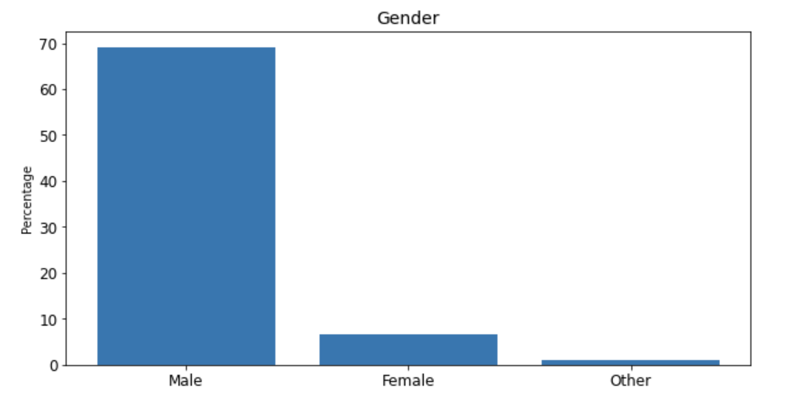
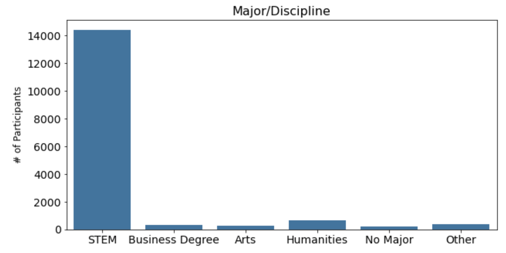

# Flatiron Phase3 - Final Project by Vi Bui
# Data Science Career Change Likelihood

## Overview

**Client:** RADS - Recruiting Awesome Data Scientists Incorporation. Data Scientist recruiting firm looking for potential future Data Scientists. 

**Data, Methodology, and Analysis:**   

Data source: HR Analytics https://www.kaggle.com/arashnic/hr-analytics-job-change-of-data-scientists  

Context: the data is from a company that is active in Big Data and Data Science and ran a training program with the intention to hire data scientists among people who successfully passed courses they conducted. 

This dataset includes current credentials, demographics, experience, education, which will help us build models for RADs about candidates that are likely to be looking for a job change. 

**Models:** 

1. Logistic Regression Classifier
2. Decision Tree Classifier
3. Random Forest Classifier
4. Gradient Booster Classifier

### Feature Description Definitions

**Features included in dataset**

enrollee_id: Unique ID for candidate

city: City code

city_development_index: Development index of the city (scaled)

gender: Gender of candidate

relevant_experience: Relevant experience of candidate

enrolled_university: Type of University course enrolled if any

education_level: Education level of candidate

major_discipline: Education major discipline of candidate

experience: Candidate total experience in years

company_size: Number of employees in current employer's company

company_type: Type of current employer

lastnewjob: Difference in years between previous job and current job

training_hours: Data science course training hours completed

target: 0 – Not looking for job change, 1 – Looking for a job change

**The data is skewed: Male; Major/Discipline - STEM

## Check for Linearity and Residual Normality using Q-Q Plot 
- There are some tails but overall residuals appear normal 

    

## Check for Homoskedasticity

- Durbin-Watson: range of 1.5 to 2.5 is relatively normal
- Model's Durbin-Watson is 2.024

## Check for Over-fitting
- Check expected vs. predicted errors of Train Test sets 
- Train and Test data are within range of each other 
- The average expected error (mean absolute error) of the Train data is \\$47,496 while the average expected error of the Test data is \\$48,684

# Evaluation and Conclusions

After building models to evaluate the relationship between price and several factors, we can offer guidance to new home buyers in WA State about the expectation of price relative to square feet of living, waterfront views, condition, and grade. 

**** Important note: the results are best suited for home buyers seeking homes with a maximum of 6 bedrooms, 4000 square feet, and a budget ranging from \\$175,000 to \\$650,000

**Conclusions** 
- The **average price for a home in King County, WA is approximately \\$400,358**
-  **The most important factors in our model, besides zipcode, are: Square Feet Living, Grade, and Condition**
- **Every additional square feet of space costs approximately \\$94. Note: other models showed this cost could be up to $200 per square feet in the densest zipcodes** 
- The grade of a home (1-13) is a strong determinant of price. **Every grade increase costs approximately \\$31,571** 
- The condition (1-5) is also a strong determinant; **Every condition level increase costs approximately \\$15,007** 
- **If the home has been renovated, the price is expected to be approximately \\$9812 more**

# Future Work 

**Future work:** 
* Refine existing models and expand dataset for different types of home buyers 
* Explore relationship of price to zip code 
* Build models for Suburbs (Medina, WA) vs. City (Seattle, WA)
* Build more comprehensive models considering other factors such as location, renovations, waterfront view 

# Repository Structure

- images 
- README.me
- Vi_Bui_Phase2_Final_Project_Presentation.pdf
- Vi_Bui_Phase2_Project_FinalFinal - Jupyter Notebook.pdf
- Vi_Bui_Phase2_Project_FinalFinal.ipynb
